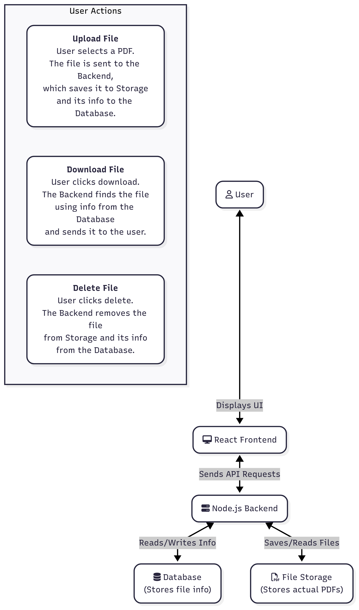

# Design Document: Patient Portal

## 1. Tech Stack Choices

**Q1. What frontend framework did you use and why? (React, Vue, etc.)**

I chose **React** for the frontend. Here's why:
* **Component-Based Architecture:** React's component-based structure makes it easy to build a modular and reusable UI. This is perfect for creating elements like the file upload form, document list, and individual document items.
* **Rich Ecosystem:** React has a vast ecosystem of libraries and tools, including state management libraries (like Redux or Zustand) and UI component libraries (like Material-UI or DaisyUI), which can speed up development.
* **Performance:** The virtual DOM allows for efficient updates and rendering, which is beneficial for creating a responsive user experience, especially when the list of documents grows.

**Q2. What backend framework did you choose and why? (Express, Flask, Django, etc.)**

I selected **Express.js** running on **Node.js** for the backend.
* **JavaScript Ecosystem:** Using JavaScript on both the frontend and backend allows for code-sharing and a more unified development experience.
* **Middleware-Based:** Express's middleware architecture is powerful and flexible. It makes it easy to handle tasks like parsing request bodies, handling file uploads (with libraries like `multer`), and implementing logging or authentication in a clean, organized way.
* **Performance:** Node.js is non-blocking and event-driven, making it highly performant and suitable for I/O-heavy operations like file uploads and downloads.
* **Simplicity and Speed:** Express is minimalist and unopinionated, which allows for rapid development and full control over the application's structure.

**Q3. What database did you choose and why? (SQLite vs PostgreSQL vs others)**

For this project, I've chosen **Prisma** which is a next-gen serverless Postgres database.
* **Declarative Schema:** The schema.prisma file provides a single source of truth for our database schema, making it easy to understand and evolve.
* **Powerful Query API:** Prisma's intuitive API makes it simple to perform complex database operations, including relations, filtering, and pagination.
* **Migrations:** Prisma Migrate allows for easy and predictable database schema migrations.

**Q4. If you were to support 1,000 users, what changes would you consider?**

To scale the application to support 1,000 users, I would make the following changes:

1.  **Authentication and Authorization:**
    * Implement a robust user authentication system (e.g., using JWTs - JSON Web Tokens). Each user would have their own account, and all API endpoints would be protected.
    * Documents would be associated with a `userId`, and API logic would ensure that users can only access their own documents.

2.  **File Storage:**
    * Storing files on the local filesystem of the server is not scalable. I would move to a cloud-based object storage.This would provide scalability, durability, and better performance for file access. The database would store a reference (URL or key) to the file in the storage service instead of a local file path.

4.  **Backend Scalability:**
    * I would consider containerizing the application using **Docker** and orchestrating it with **Kubernetes** to handle scaling and load balancing as the number of users grows.

5.  **Security:**
    * Implement rate limiting to prevent abuse.
    * Add more comprehensive input validation and sanitization.
    * Ensure proper CORS configuration for security.

## 2. Architecture Overview

The application follows a classic client-server architecture:

* **Frontend (React):** The user interacts with the React application running in their browser. It provides the UI for uploading, viewing, and managing documents. It communicates with the backend via REST API calls.
* **Backend (Node.js/Express):** This is the API server. It handles incoming requests from the frontend, interacts with the database to manage metadata, and manages the physical files in the file storage.
* **Database (SQLite/PostgreSQL):** Stores the metadata for each uploaded document (e.g., filename, size, path).
* **File Storage (`uploads/` folder or Cloud Storage):** This is where the actual PDF files are stored.

**Flow Diagram:**



## 3. API Specification

Here are the specifications for the REST API endpoints.

---

### Upload a Document

* **URL:** `/api/documents/upload`
* **Method:** `POST`
* **Description:** Uploads a new PDF document. The file is sent as `multipart/form-data`.
* **Sample Request:**
    `POST /api/documents/upload`
    `Content-Type: multipart/form-data`

    Body:
    * `file`: The PDF file to be uploaded.

* **Sample Success Response (201 Created):**
    ```json
    {
      "id": "clxqz3t4a0000v9z69j8f7k3l",
      "filename": "prescription.pdf",
      "filepath": "uploads/1722880800000-prescription.pdf",
      "filesize": 123456,
      "created_at": "2025-08-05T18:00:00.000Z"
    }
    ```
* **Sample Error Response (400 Bad Request):**
    ```json
    {
      "error": "No file uploaded or file is not a PDF."
    }
    ```

---

### List All Documents

* **URL:** `/api/documents`
* **Method:** `GET`
* **Description:** Retrieves a list of all uploaded documents.
* **Sample Request:**
    `GET /api/documents`

* **Sample Success Response (200 OK):**
    ```json
    [
      {
        "id": "clxqz3t4a0000v9z69j8f7k3l",
        "filename": "prescription.pdf",
        "filesize": 123456,
        "created_at": "2025-08-05T18:00:00.000Z"
      },
      {
        "id": "clxqz4u5b0001v9z6a7b8c9d0",
        "filename": "lab_results.pdf",
        "filesize": 789012,
        "created_at": "2025-08-05T18:05:00.000Z"
      }
    ]
    ```

---

### Download a Document

* **URL:** `/api/documents/:id`
* **Method:** `GET`
* **Description:** Downloads a specific document by its ID.
* **Sample Request:**
    `GET /api/documents/clxqz3t4a0000v9z69j8f7k3l`

* **Sample Success Response (200 OK):**
    The response body will be the raw PDF file content with the appropriate `Content-Type` and `Content-Disposition` headers.

* **Sample Error Response (404 Not Found):**
    ```json
    {
      "error": "Document not found."
    }
    ```

---

### Delete a Document

* **URL:** `/api/documents/:id`
* **Method:** `DELETE`
* **Description:** Deletes a specific document by its ID.
* **Sample Request:**
    `DELETE /api/documents/clxqz3t4a0000v9z69j8f7k3l`

* **Sample Success Response (200 OK):**
    ```json
    {
      "message": "Document deleted successfully."
    }
    ```

* **Sample Error Response (404 Not Found):**
    ```json
    {
      "error": "Document not found."
    }
    ```

## 4. Data Flow Description

**Q5. Describe the step-by-step process of what happens when a file is uploaded and when it is downloaded.**

**File Upload Process:**
1.  **User Interaction:** The user selects a PDF file using the upload form in the React frontend.
2.  **Frontend Request:** Upon clicking "Upload," the frontend creates a `FormData` object, appends the file to it, and sends a `POST` request to the `/api/documents/upload` endpoint.
3.  **Backend Middleware:** The Express backend receives the request. The `multer` middleware processes the `multipart/form-data`, extracts the file, and saves it to a temporary location. It also performs a file type validation to ensure it's a PDF.
4.  **File Storage:** If the file is valid, it's moved from the temporary location to the permanent `uploads/` directory with a unique name (e.g., timestamp + original filename) to prevent name collisions.
5.  **Database Interaction:** The backend then creates a new record in the `documents` table using Prisma, saving the original filename, the new file path on the server, the file size, and the creation timestamp.
6.  **Backend Response:** The backend sends a `201 Created` response to the frontend with the JSON data of the newly created document record.
7.  **Frontend Update:** The frontend receives the successful response, displays a success message, and updates the document list to include the new file.

**File Download Process:**
1.  **User Interaction:** The user clicks the "Download" button for a specific document in the list.
2.  **Frontend Request:** The frontend gets the document's `id` and makes a `GET` request to `/api/documents/:id`.
3.  **Backend Logic:** The backend receives the request and uses the `id` to query the database via Prisma to find the corresponding document record.
4.  **File Retrieval:** If the document is found, the backend retrieves its `filepath` and `filename` from the database record. It then reads the file from the `uploads/` directory.
5.  **Backend Response:** The backend sets the appropriate HTTP headers:
    * `Content-Type: application/pdf`
    * `Content-Disposition: attachment; filename="original_filename.pdf"` (This tells the browser to prompt a download).
    * It then streams the file's content as the response body.
6.  **Browser Action:** The browser receives the response and, due to the headers, initiates a file download dialog for the user.

## 5. Assumptions

**Q6. What assumptions did you make while building this?**

* **Single User:** The application is built for a single user. There is no concept of user accounts, login, or data separation between different users.
* **No Authentication:** All API endpoints are public and do not require any authentication or authorization.
* **Specific file type(PDF):** Allowed only the PDF file type.
* **File Size Limit:** I'm assuming a reasonable file size limit will be handled by the server configuration (e.g., Express's default limits). For a production app, this would be explicitly configured (e.g., `limits: { fileSize: 10 * 1024 * 1024 }` for 10MB).
* **Error Handling:** Basic error handling is in place (e.g., file not found, invalid file type), but a production system would require more comprehensive logging and error monitoring.
* **Concurrency:** No specific measures are taken to handle high concurrency (e.g., multiple simultaneous uploads). For a single-user local app, this is not a concern.